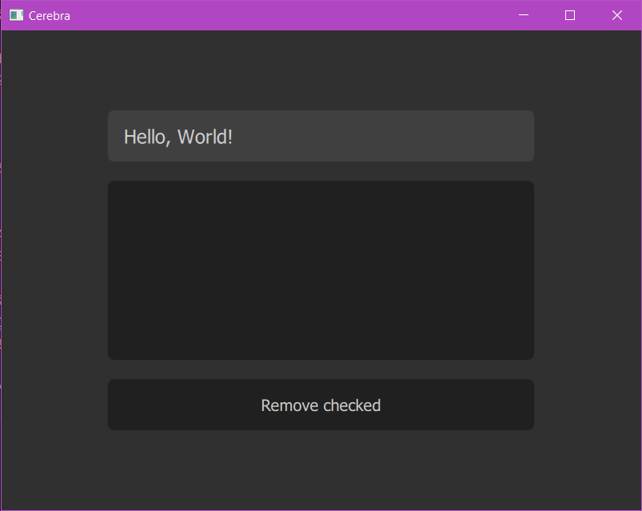

# Приложение для добавления/удаления записей

## Выполненные задачи

1. Создал оконное приложение Qt Quick.
2. В окне вертикально расположить 3 элемента:
   * элемент однострочного ввода текста;
   * списковое представление модели данных, размещающее элементы по типу потока (flow);
   * кнопку для добавления отмеченных записей.
3. Описал модель данных на C++, унаследовавшись от QAbstractItemModel, которая хранит в себе:
   * текст записи;
   * флаг, который говорит, отмеченна ли эта запись.
4. Реализовал контекстное меню, которое появляется при нажатии на запись правой кнопкой мыши.
5. Кастомизировал элементы управления.

## Реализации

Приложение написанно на **C++** с использованием **фреймворка Qt** версии 5.15.2 и **Qt Quick** версии 2.15.
Компилятор: MinGW 64-bit, система сборки: qmake.

Структура проекта:

## Функционал/Скриншоты
Окно приложения:

Мы можем **_добавить новую запись_**, введя текст в текстовое поле и нажав "Enter"

Добавим еще записи:

Нажав на **_крестик рядом с записью_**, мы можем удалить ее:

Можно **_пролистать представление модели_** с помощью колесика мыши:

Мы можем **_выделить элементы_**, нажав на них правой кнопкой мыши:

Если нажать левой копкой мыши на элемент, то появится **_контекстное меню_**:

При нажатии на "Block deletion", у записи **_заблокируется возможность ее удаления_** крестиком или кнопкой "Remove сhecked":

Однако останется возможность **_принудительного удаления_** командой "Force delete" в контекстном меню (также есть возможность в этом же контекстном меню **_отменить блокировку_** командой "Unblock deletion"):

**_Удалить все выделенные объекты_** мы можем с помощью кнопки "Remove сhecked":

